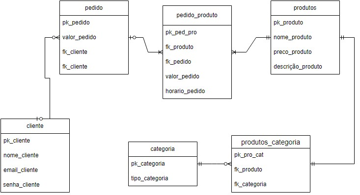

# Projeto Integrador - Modelo
**Popped**

Um modelo para o desenvolvimento do Projeto Integrador do Curso de Técnico em Desenvolvimento de Sistemas para a Internet Integrado ao Ensino Médio do IFC - Campus Araquari.
*(Popped uma marca de refrigerante onde vende suas peças de roupa.)*

Professor: [Marco André Mendes](https://github.com/marrcandre/)

Equipe:
- [Rafael de França](https://github.com/eoFrancaa)
- [Eduardo Gabriel dos Santos](https://github.com/dudug05)
- [Leandro Gustavo dos Santos](https://github.com/LeandroVish)
- [Ana Sofia Berg](https://github.com/AsBergs)

Links do projeto:
-   [Documentação](https://github.com/eoFrancaa/PI-Modelo.git)
-   Backend: [Repositório](https://github.com/eoFrancaa/Popped_Django.git) e [Publicação]([https://pi-backend.herokuapp.com/](https://popped-django.onrender.com/))
-   Frontend: [Repositório](https://github.com/eoFrancaa/PI-Popped.git) e [Publicação](https://popped.vercel.app/)
-   Figma: [Figma](https://www.figma.com/design/SkJenuEAVLTm8ohVF58d9U/popped-2?node-id=0-1&t=eWVdDOfAPVwW2bi5-1)

# 1. Desenvolvimento
# 1.1 Modelos de Sistemas
Modelo Escolhido: Ponto de Vendas (PDV)

Descrição do Sistema:
O sistema a ser desenvolvido para a "Popped" irá gerenciar as operações de vendas tanto de refrigerantes quanto de roupas. A "Popped" é uma marca conhecida por suas bebidas refrescantes e sua linha de roupas com a marca. O sistema irá integrar a gestão de vendas, controle de estoque e geração de relatórios, abrangendo tanto as lojas físicas quanto a plataforma de e-commerce.

Motivo da Escolha:
Escolhemos o modelo de Ponto de Vendas (PDV) porque ele é ideal para o gerenciamento integrado de vendas de diversos tipos de produtos, neste caso, refrigerantes e roupas. A integração dos processos de vendas e controle de estoque ajudará a otimizar a operação, melhorar a eficiência e fornecer informações valiosas para a tomada de decisões.

# 2. Situação Problema
**Introdução:**
A "Popped" é uma marca que combina a venda de refrigerantes e roupas com sua marca. Fundada há três anos, a empresa tem se expandido rapidamente, com lojas físicas em várias cidades e uma plataforma de e-commerce ativa. A equipe é composta por gerentes de loja, atendentes, e pessoal de logística. A empresa enfrenta desafios relacionados ao gerenciamento de suas operações de vendas e controle de estoque.

**Situação-Problema:**
Atualmente, a "Popped" enfrenta vários problemas operacionais:

Gerenciamento de Estoque: O controle de estoque de refrigerantes e roupas é feito de maneira separada, resultando em falta de visibilidade e dificuldades na coordenação do inventário. Isso leva a problemas como falta de produtos em estoque e excesso de alguns itens.

Processo de Venda: As vendas são processadas por sistemas diferentes para bebidas e roupas, o que dificulta a integração dos dados e a visão geral das vendas. Isso também afeta a precisão dos relatórios e a capacidade de análise.

Relatórios e Análises: A geração de relatórios é realizada manualmente e não fornece uma visão consolidada do desempenho das vendas e do inventário. A falta de relatórios detalhados impede uma análise eficaz e a tomada de decisões informadas.

**Conclusão:**
A falta de um sistema integrado para gerenciar as vendas e o estoque da "Popped" está prejudicando a eficiência operacional e a capacidade de análise da empresa. Um sistema de Ponto de Vendas (PDV) integrado pode resolver esses problemas ao consolidar dados, melhorar o controle de estoque e facilitar a geração de relatórios precisos.

# 3. Descrição da Proposta
**Foco de Ação do Software:**
O software proposto será um sistema de Ponto de Vendas (PDV) que integrará a gestão das vendas de refrigerantes e roupas. As principais funções do sistema incluirão:

Gerenciamento de Estoque: Controle unificado do estoque de refrigerantes e roupas, com atualizações em tempo real e alertas para reabastecimento quando os níveis de estoque estiverem baixos.

Processo de Venda: Sistema único para registrar e processar transações de vendas tanto de refrigerantes quanto de roupas, tanto nas lojas físicas quanto na plataforma de e-commerce.

Geração de Relatórios: Relatórios detalhados sobre vendas, estoque e desempenho dos produtos, com capacidade de gerar análises consolidadas e personalizadas para apoiar a tomada de decisões.

**Níveis de Usuário:**

Administrador: Acesso total para configurar produtos, gerenciar usuários, e gerar relatórios completos. Pode acessar e modificar todas as áreas do sistema.

Gerente de Loja: Acesso para gerenciar vendas e estoque na loja física, visualizar e gerar relatórios de vendas e controlar o inventário da loja.

Atendente: Acesso para realizar transações de vendas e consultar o estoque. Sem permissões para alterar configurações ou gerar relatórios avançados.

**Funcionalidades Principais:**

Cadastro e gerenciamento de produtos (refrigerantes e roupas).
Controle de estoque com atualizações em tempo real e alertas para reabastecimento.
Registro e processamento de vendas em lojas físicas e online.
Geração de relatórios detalhados sobre vendas, estoque e performance.
Interface de integração com a plataforma de e-commerce para sincronização de dados.

# 4. Modelagem de Dados

# 4. Regras de negócio

 Abaixo estão os requisitos funcionais e não funcionais para o sistema de Ponto de Vendas (PDV) proposto pela a Popped.

## Requisitos Funcionais

1. **Cadastro e Gerenciamento de Produtos**
   - **RF01**: O sistema deve permitir o cadastro de novos produtos, incluindo informações como nome, descrição, preço, categoria (refrigerantes ou roupas), e imagens.
   - **RF02**: O sistema deve permitir a edição e exclusão de produtos cadastrados.
   - **RF03**: O sistema deve permitir a organização dos produtos em categorias e subcategorias para facilitar a navegação e a busca.

2. **Gerenciamento de Estoque**
   - **RF04**: O sistema deve manter um controle unificado do estoque para refrigerantes e roupas.
   - **RF05**: O sistema deve atualizar o nível de estoque em tempo real após cada transação de venda.
   - **RF06**: O sistema deve emitir alertas automáticos para reabastecimento quando os níveis de estoque de um produto atingirem um limite mínimo pré-definido.
   - **RF07**: O sistema deve permitir o ajuste manual do estoque para corrigir discrepâncias.

3. **Processo de Venda**
   - **RF08**: O sistema deve permitir o registro e processamento de transações de venda para refrigerantes e roupas, tanto nas lojas físicas quanto na plataforma de e-commerce.
   - **RF09**: O sistema deve suportar diferentes formas de pagamento (dinheiro, cartão de crédito, débito, etc.).
   - **RF10**: O sistema deve gerar recibos de venda e permitir o envio de comprovantes por e-mail ou impressão.

4. **Geração de Relatórios**
   - **RF11**: O sistema deve gerar relatórios detalhados sobre vendas, incluindo total de vendas, produtos mais vendidos e desempenho por loja e por período.
   - **RF12**: O sistema deve gerar relatórios de estoque, mostrando níveis de inventário, produtos com baixo estoque e histórico de movimentação.
   - **RF13**: O sistema deve permitir a exportação de relatórios em formatos como PDF e Excel.

5. **Interface de Integração com a Plataforma de E-commerce**
   - **RF14**: O sistema deve integrar-se com a plataforma de e-commerce para sincronização de dados de produtos, vendas e estoque.
   - **RF15**: O sistema deve atualizar o estoque automaticamente na plataforma de e-commerce após cada venda realizada.

6. **Gerenciamento de Usuários**
   - **RF16**: O sistema deve permitir a criação e gestão de diferentes tipos de usuários (Administrador, Gerente de Loja, Atendente) com permissões específicas.
   - **RF17**: O sistema deve registrar e auditar todas as ações realizadas pelos usuários para fins de segurança e controle.

## Requisitos Não Funcionais

1. **Desempenho**
   - **RNF01**: O sistema deve processar transações de vendas em menos de 2 segundos por operação para garantir um atendimento rápido.
   - **RNF02**: O sistema deve atualizar o estoque em tempo real com uma latência não superior a 5 segundos após uma transação de venda.

2. **Segurança**
   - **RNF03**: O sistema deve garantir que todos os dados sensíveis (como informações de pagamento) sejam criptografados.
   - **RNF04**: O sistema deve implementar autenticação forte para todos os usuários e permitir a recuperação de senha de maneira segura.
   - **RNF05**: O sistema deve proteger contra acesso não autorizado e deve permitir a configuração de permissões baseadas em funções de usuário.

3. **Escalabilidade**
   - **RNF06**: O sistema deve ser capaz de suportar o crescimento do número de produtos, usuários e transações sem degradação significativa de desempenho.
   - **RNF07**: O sistema deve permitir a adição de novas lojas e a integração com futuros canais de venda sem necessidade de grandes modificações.

4. **Usabilidade**
   - **RNF08**: O sistema deve ter uma interface intuitiva e amigável, com fácil navegação para todos os níveis de usuários.
   - **RNF09**: O sistema deve fornecer ajuda contextual e tutoriais para auxiliar novos usuários na utilização das funcionalidades.

5. **Disponibilidade e Manutenção**
   - **RNF10**: O sistema deve ter uma disponibilidade mínima de 99,5% ao longo do ano.
   - **RNF11**: O sistema deve permitir a realização de backups automáticos diários e a recuperação de dados em caso de falhas.

6. **Compatibilidade**
   - **RNF12**: O sistema deve ser compatível com os principais navegadores web (Chrome, Firefox, Edge) e dispositivos móveis.
   - **RNF13**: O sistema deve ser compatível com os principais sistemas operacionais utilizados nas lojas físicas e plataformas de e-commerce.

# Modelagem do banco

<!--[Atores Notação](img/dcu_atores_notacao.png "Atores Notação")

**Exemplo: Loja de CDs**

**Identificando os atores**
- Uma loja de CDs possui discos para venda. Um cliente pode comprar uma quantidade ilimitada de discos para isto ele deve se dirigir à loja.
- A loja possui um **atendente** cuja função é atender os clientes durante a venda dos discos. A loja também possui um **gerente** cuja função é administrar o estoque para que não faltem discos. Além disso é ele quem dá folga ao atendente, ou seja, ele também atende os clientes durante a venda dos discos.

**E o cliente?**
- Não é ator pois ele **não interage** com o sistema!

**7.2.2 Casos de uso**

- Representam **funcionalidades** do sistema (requisitos funcionais).
- São iniciados por **atores** ou por outros casos de uso.

> **Dica**: nomeie os casos de uso com **verbos** no **infinitivo**.

Notação:

**Exemplo: Loja de CDs**

**Identificando os casos de uso**

- Uma loja de CDs possui discos para venda. Um cliente pode comprar uma quantidade ilimitada de discos para isto ele deve se dirigir à loja. A loja possui um atendente cuja função é atender os clientes durante a **venda dos discos**.
- A loja também possui um gerente cuja função é **administrar o estoque** para que não faltem discos. Além disso é ele quem dá folga ao atendente, ou seja, ele também atende os clientes durante a **venda dos discos**.

**7.2.3 Relacionamentos**

**7.2.3.1 Relacionamento de associação**

- Indica que um ator **participa** de um caso de uso, ou seja, o ator **interage** (comunica-se) com o caso de uso.
- É representado por uma **linha sólida**.
- Um ator pode se relacionar com **um ou mais casos de uso**.

> Dicas:
> - Não use setas nas linhas de associação.
> - Associações não representam fluxo de informação.

**Exemplo: Loja de CDs**

**Identificando os relacionamentos de associação**

- Uma loja de CDs possui discos para venda. Um cliente pode comprar uma quantidade ilimitada de discos para isto ele deve se dirigir à loja. A loja possui um _atendente_ cuja função é atender os clientes durante a **venda dos discos**.
- A loja também possui um _gerente_ cuja função é **administrar o estoque** para que não faltem discos. Além disso é ele quem dá folga ao _atendente_, ou seja, ele também atende os clientes durante a **venda dos discos**.

**7.2.3.2 Relacionamento de generalização/especialização**

**Generalização de atores**

- Quando dois ou mais atores podem se **comunicar com o mesmo conjunto de casos de uso**.
- Indica que um ator **herda** as características de outro ator.
– Um filho (herdeiro) pode se comunicar com todos os casos de uso que seu pai se comunica.

> **Dica:** coloque os herdeiros **embaixo**.

**Notação:**

**Exemplo: Loja de CDs**

**Identificando os relacionamentos de generalização/especialização de atores**

**Generalização de casos de uso**

– O caso de uso filho herda o comportamento e o significado do caso de uso pai.
– O caso de uso filho pode incluir ou sobrescrever o comportamento do caso de uso pai.
– O caso de uso filho pode substituir o caso de uso pai em qualquer lugar que ele apareça.

> **Dica:** deve ser aplicada quando uma condição resulta na definição de
diversos fluxos alternativos.

Notação:

**Exemplo: Loja de CDs**

**Identificando os relacionamentos de generalização/especialização de casos de uso**

**Novos requisitos:**

- As vendas podem ser **à vista** ou **a prazo**. Em ambos os casos o estoque é
atualizado e uma nota fiscal, entregue ao consumidor.
- No caso de uma **venda à vista**, clientes cadastrados na loja e que compram mais de 5 CDs de uma só vez ganham um desconto de 1% para cada ano de cadastro.
- No caso de uma **venda a prazo**, ela pode ser parcelada em 2 pagamentos com um
acréscimo de 20%. As vendas a prazo podem ser pagas no **cartão** ou no **boleto**.
  - Para pagamento com **boleto**, são gerados boletos bancários que são entregues ao cliente e armazenados no sistema para lançamento posterior no caixa.
  - Para pagamento com **cartão**, os clientes com mais de 10 anos de cadastro na loja ganham o mesmo desconto das compras à vista.

**Identificando mais relacionamentos de generalização/especialização de casos de uso**

**7.2.3.3 Relacionamento de dependência**

**Extensão**

- Representa uma variação/extensão do comportamento do caso de uso base.
- O caso de uso estendido só é executado sob certas circunstâncias.
- Separa partes obrigatórias de partes opcionais.
  - Partes obrigatórias: caso de uso base.
  - Partes opcionais: caso de uso estendido.
- Fatorar comportamentos variantes do sistema (podendo reusar este comportamento
em outros casos de uso).

**Notação:**

 - notação")

**Exemplo: Loja de CDs**

**Identificando os relacionamentos de dependência (extensão)**

**Novos requisitos:**
- No caso de uma venda à vista, clientes cadastrados na loja e que compram mais
de 5 CDs de uma só vez ganham um **desconto** de 1% para cada ano de cadastro.
- No caso de uma venda a prazo...
  - ...Para pagamento com cartão, os clientes com mais de 10 anos de cadastro na loja ganham o mesmo **desconto** das compras à vista.

")

**Inclusão**

- Evita repetição ao fatorar uma atividade
comum a dois ou mais casos de uso.
- Um caso de uso pode incluir vários casos de uso.

**Notação:**

 - notação")

**Exemplo: Loja de CDs**

**Novos requisitos:**
Para efetuar vendas ou administrar estoque, atendentes e gerentes terão que **validar** suas respectivas senhas de
acesso ao sistema.

")

**7.2.4 Fronteira do sistema**

- Elemento opcional (mas essencial para um bom
entendimento).
- Serve para definir a área de atuação do sistema, ou seja, seus limites.

**Identificando a fronteira do sistema**

---

 -->
